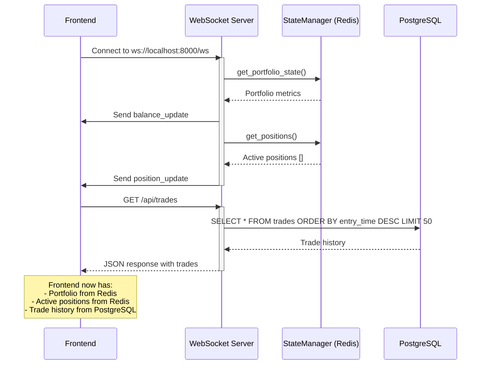
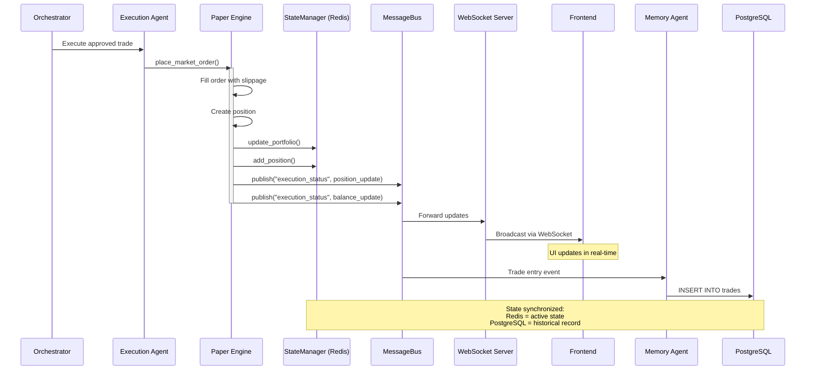
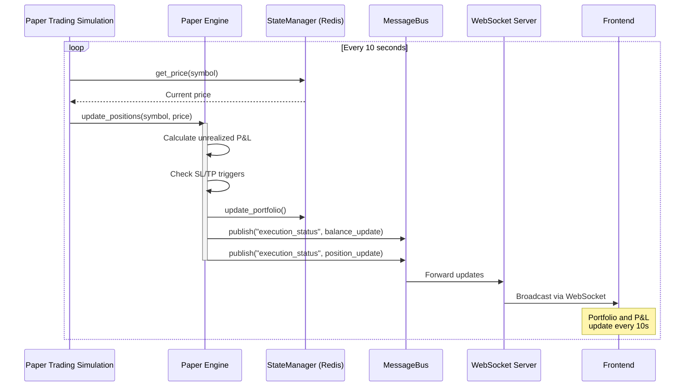
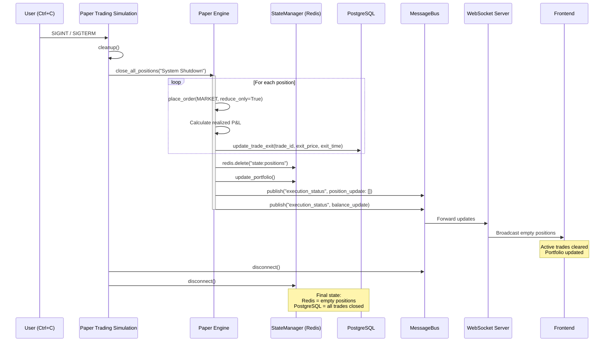
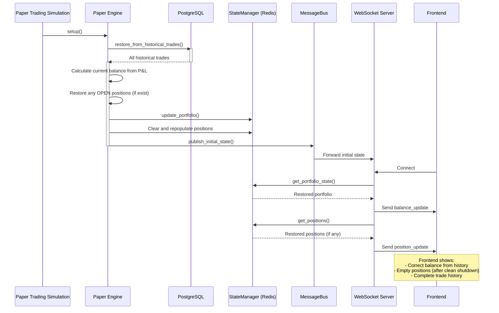

# Trading System Data Flow Guide

## Overview

This document explains how data flows through the multi-agent crypto trading system, from initial startup to real-time updates and shutdown.

## State Storage Architecture

### Redis (StateManager) - Hot State
**Purpose**: Fast, in-memory storage for active trading state

**Stored Data**:
- `state:portfolio` (Hash): Current portfolio metrics
  - `initial_balance`, `current_balance`, `total_equity`
  - `unrealized_pnl`, `realized_pnl`, `win_rate`
  - `total_trades`, `total_commission`, `max_drawdown`
- `state:positions` (List): Active open positions
  - Each position includes: symbol, side, quantity, entry_price, current_price, unrealized_pnl
- `state:current_prices` (Hash): Latest market prices for symbols
- `state:agent_states`: Agent health and status information

**Why Redis?**
- Sub-millisecond read/write for real-time trading decisions
- Pub/Sub for event-driven architecture
- Automatic expiration for temporary state

### PostgreSQL - Persistent State
**Purpose**: Durable storage for historical data and audit trail

**Stored Data**:
- `trades` table: Complete trade history
  - Entry details: symbol, direction, entry_price, entry_time, position_size
  - Exit details: exit_price, exit_time, exit_reason
  - Performance: pnl, pnl_percentage, r_multiple, duration_minutes
  - Metadata: strategy_type, confidence_score, analysis_snapshot
- `agent_states` table: Agent health history
- `market_data` table: Historical candles and indicators (if enabled)

**Why PostgreSQL?**
- ACID compliance for data integrity
- Complex queries for performance analysis
- Survives system restarts

## Data Flow Diagrams

### Frontend Initialization Flow



### Trade Execution Flow



### Position Update Flow (Continuous)



### System Shutdown Flow



### System Restart Flow



## Key Data Flow Principles

### 1. Single Source of Truth

- **Active State**: Redis is the source of truth for current positions and portfolio
- **Historical State**: PostgreSQL is the source of truth for trade history
- **Price Data**: Redis stores latest prices, but they're ephemeral (updated by Data Agent)

### 2. Write Path

```
Trade Event → Paper Engine → Redis (immediate) → MessageBus → Frontend (real-time)
                           ↓
                    Memory Agent → PostgreSQL (persistent)
```

### 3. Read Path

**On Startup**:
```
Frontend → WebSocket → Redis (portfolio + positions)
Frontend → REST API → PostgreSQL (trade history)
```

**Real-time**:
```
Frontend ← WebSocket ← MessageBus ← Paper Engine
```

### 4. Synchronization

- **Normal Operation**: Redis and PostgreSQL stay in sync via MessageBus events
- **On Shutdown**: Positions closed → Redis cleared → PostgreSQL updated
- **On Restart**: PostgreSQL history → Calculate balance → Restore to Redis

## Common Scenarios

### Scenario 1: Fresh Start (No History)
1. System starts with `initial_balance = $10,000`
2. Redis: `portfolio.current_balance = 10000`, `positions = []`
3. PostgreSQL: `trades` table empty
4. Frontend shows: $10,000 balance, 0 active trades, no history

### Scenario 2: After First Trade Execution
1. Trade executed: BUY BTC/USDT @ $95,000
2. Redis: `positions = [BTC/USDT LONG]`, `portfolio.unrealized_pnl = $0`
3. PostgreSQL: 1 row in `trades` with `exit_time = NULL`
4. Frontend shows: 1 active trade, P&L updating in real-time

### Scenario 3: Trade Closes (TP Hit)
1. Price reaches take-profit level
2. Paper Engine closes position
3. Redis: `positions = []`, `portfolio.realized_pnl = +$500`
4. PostgreSQL: Trade row updated with `exit_price`, `exit_time`, `pnl = 500`
5. Frontend shows: 0 active trades, 1 closed trade in history, balance = $10,500

### Scenario 4: System Shutdown with Active Trade
1. User presses Ctrl+C
2. `cleanup()` calls `close_all_positions()`
3. Position closed at market price
4. Redis: `positions = []`
5. PostgreSQL: Trade updated with `exit_reason = "System Shutdown"`
6. Frontend receives empty positions via WebSocket
7. On restart: Balance reflects closed trade, no active positions

### Scenario 5: System Restart After Clean Shutdown
1. System starts
2. `restore_from_historical_trades()` reads PostgreSQL
3. Calculates: `balance = initial_balance + sum(all_closed_trades.pnl) - total_commission`
4. Redis populated with calculated portfolio
5. Frontend connects and receives restored state
6. Everything matches pre-shutdown state (except no active positions)

## Troubleshooting

### Issue: Frontend shows $0 balance on startup
**Cause**: WebSocket not connected or Redis empty
**Check**:
1. Is backend server running? (`python -m uvicorn src.api.server:app --host 0.0.0.0 --port 8000`)
2. Is Redis running? (`redis-cli ping` should return `PONG`)
3. Check browser console for WebSocket connection errors

**Fix**: Ensure `publish_initial_state()` is called in `run_paper_trading_simulation.py` after engine initialization

### Issue: Active trade persists after shutdown
**Cause**: `close_all_positions()` not called or failed
**Check**:
1. Look for "🚨 Closing all active positions..." in shutdown logs
2. Check PostgreSQL: `SELECT * FROM trades WHERE exit_time IS NULL`
3. Check Redis: `redis-cli LRANGE state:positions 0 -1`

**Fix**: Ensure `cleanup()` in `run_paper_trading_simulation.py` properly awaits `close_all_positions()`

### Issue: Balance incorrect after restart
**Cause**: `restore_from_historical_trades()` calculation error
**Check**:
1. Verify all closed trades have `pnl` values in PostgreSQL
2. Check for any trades with `exit_time = NULL` (should be closed on shutdown)
3. Review `restore_from_historical_trades()` logs for calculation details

**Fix**: Manually close any orphaned trades in database or clear and restart with fresh balance

### Issue: WebSocket broadcast errors
**Cause**: Attempting to send to closed connections
**Check**: Server logs for "Cannot call send once a close message has been sent"
**Fix**: Implement connection state validation in `broadcast()` method (see implementation plan)

## Best Practices

1. **Always use `publish_portfolio_update()`** after modifying positions or balance
2. **Never directly modify Redis** without also updating PostgreSQL for persistent changes
3. **Use StateManager methods** (`update_portfolio`, `add_position`) instead of raw Redis commands
4. **Verify database updates** in `close_all_positions()` before clearing Redis
5. **Wait for broadcasts** to complete before shutting down components
