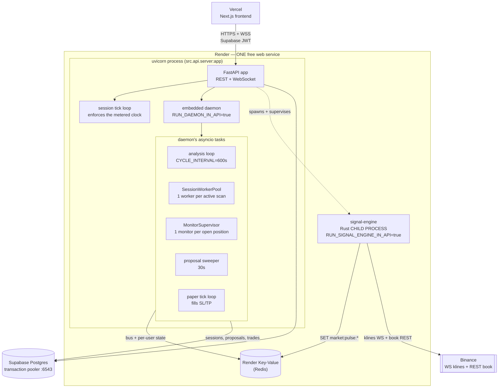
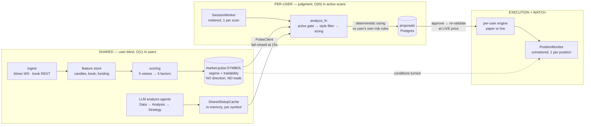
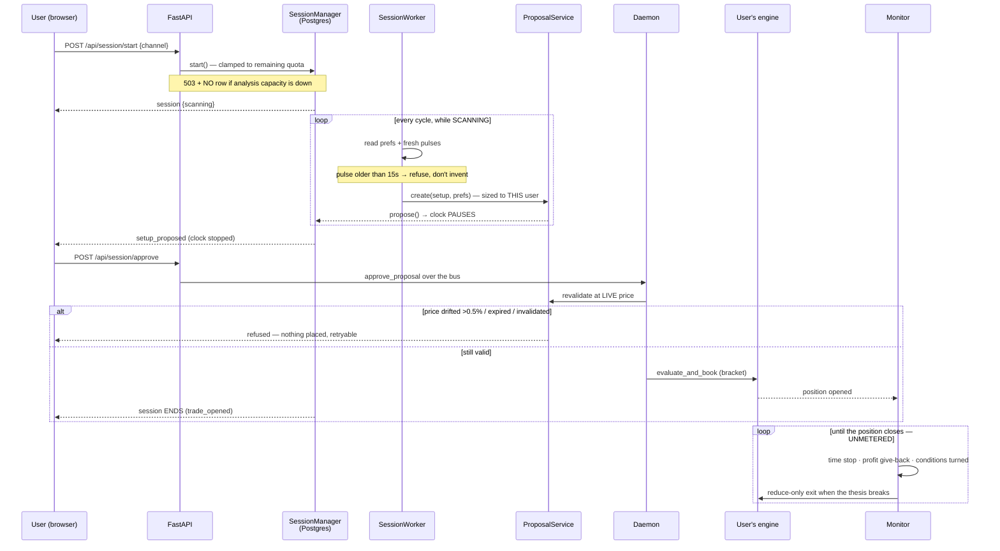

# CryptAI — Architecture as Actually Built

> **Read this before `HLD.md` or `MULTI_TENANCY.md`.** Those describe the target. This
> describes what the code does today, derived by reading the call sites — every box and
> arrow below was traced in source, and anything inferred is marked `assumed`.
>
> Verified 2026-08-11 against branch `fix/m1-foundation-bugs`.
> **Verified:** process startup in `src/api/server.py`, daemon task spawning in
> `src/multi_user_daemon.py`, the pulse key contract in `signal-engine/src/publish.rs` ↔
> `src/signals/pulse_client.py`, session/proposal/monitor wiring, per-user engine
> construction in `src/core/multi_user.py`.
> **Assumed:** nothing structural. Where a component exists but nothing calls it, it is
> drawn dashed and called out.

---

## 1. What actually runs — process topology

**Question: on production today, what processes exist?**

The HLD describes four services. Production runs **one**, because the free tier allows one
always-on web service. Everything else is a task or child process inside it.

**What's notable**

- **One process is the whole backend.** A crash takes down the API, the agents, the
  monitors and the signal engine together. The HLD's separate `cryptai-daemon` worker was
  never created; `RUN_DAEMON_IN_API=true` is the production reality.
- **The signal engine is a child process, not a service.** It ships inside the same Docker
  image (repo-root `Dockerfile`, Rust stage → binary copied into the Python image) and is
  supervised with backoff. If it dies, sessions run ungated rather than the product going
  down.
- **Redis is three things at once**: the agent message bus, per-user hot state
  (`state:{user_id}:*`), and the pulse plane (`market:pulse:*`). The pulse keys are
  deliberately *not* user-namespaced — that asymmetry is the tenancy boundary made visible.
- **Postgres goes through the transaction pooler.** The session pooler's 15-client cap was
  exhausted by ~7 engines in one process; `statement_cache_size=0` is required and must not
  be reverted independently of the `:6543` port.

---

## 2. How data moves — the three planes

**Question: how does a market tick become a trade the user approved?**

**What's notable**

- **The split is real and it is the product's core idea.** Facts (regime, tradability,
  structure) are computed once for everyone. Judgment (which setup, what size, whether it
  clears *your* bar) is computed per user, per scan. That is what makes the metered minute
  mean something.
- **The pulse carries no trade decision** — no entry, no stop, no side. The engine's own
  walk-forward eval refuted regime-as-direction, so the contract forbids it. A consumer
  mapping regime → side would be reintroducing a claim the data killed.
- **Two independent Binance consumers** (the engine's ingest, and the API's dashboard
  feed). Both were unbounded and together exhausted a 5GB/month allowance; both are now
  demand- or cadence-bounded.
- **`SharedSetupCache` is in-memory**, so a restart loses cached setups until the next
  analysis cycle. Sessions started in that window find nothing and say so honestly.

---

## 3. The user's loop, end to end

**Question: what happens between "find me a trade" and a watched position?**

**What's notable**

- **The clock pauses at `setup_proposed`.** Deliberation is free — that is the fairness
  mechanic, and it is enforced server-side in the derived clock, not by the UI.
- **Approval re-validates at the live price.** A proposal approved three minutes later is
  not the same trade; drift past 0.5% is refused rather than filled worse than agreed.
- **The monitor outlives the session.** Quota exhaustion never stops it — a money-safety
  property, not a billing one.
- **A refused approval is retryable** and leaves the proposal live; a terminal refusal
  resumes scanning. Both paths are covered because getting this wrong stranded sessions.

---

## 4. Reality vs. the HLD

| HLD / MULTI_TENANCY says | Reality today | Gap matters? |
|---|---|---|
| Signal engine is its own always-on service | Child process inside the API container | Cosmetic on free tier; revisit at scale |
| Separate `cryptai-daemon` worker | Embedded via `RUN_DAEMON_IN_API=true` | One crash domain — accepted for now |
| Session workers, monitors, sweeper exist | ✅ All built, wired, running | — |
| Pulse gates every session, fail-closed at 15s | ✅ Wired (`SIGNAL_PLANE_ENABLED=true`) | — |
| Setup **synthesis** is per-user (the LLM thesis) | ⚠️ **Selection + thesis are per-user** (`src/core/synthesis.py`); candidate *generation* is still shared per symbol | Partly closed — see below |
| Analysis runs on demand | ✅ Demand-gated: ≥1 active scan, or the owner's override | Closed |
| Engine switch is an emergency stop, not a gate | ✅ No longer gates the worker pool; refuses new scans at the door instead | Closed |
| Per-user LLM cost cap enforced | ✅ `analyze_fn` returns real usage, so the cap guards a moving number | Closed |
| Money in integer minor units | ❌ `Float` everywhere except `llm_cost_micros` | Yes, before real money |
| Per-user LLM cost cap enforced | Partially: cap exists; shared analysis spend isn't attributed to a session | Yes, before paid tiers |

### Where the three gaps landed

1. **Analysis is demand-driven** (`a18059f`). A cycle runs when someone is actually
   scanning, or when the owner switches it on to keep setups warm. Zero scans and no
   override means zero LLM spend, which is what makes the free tier's cost model real. The
   demand check fails closed when the session store is unreachable.
2. **The switch is an emergency stop, not a gate** (`a18059f`). It no longer starves the
   worker pool. A scan that exists was authorized to exist, because the capacity gate on
   `POST /api/session/start` refuses one outright (503, no row, no clock) when analysis is
   off. Capacity lost *mid*-scan ends the session and refunds the dead time instead of
   silently charging for it.
3. **Per-user synthesis exists** (`9e4e94f`, `src/core/synthesis.py`) — partly. Each
   session now asks the model which candidate suits *this* trader given their capital, risk
   appetite, style, goal, notes and current book, and gets a thesis in their terms. The
   model **selects and explains; it never invents a price** — hallucinated levels are
   indistinguishable from real ones until they fill.

**What is still shared in step 3:** candidate *generation*. The analysis agents produce the
same pool of setups for everyone, and synthesis picks from that pool. Genuinely per-user
generation — running the strategy agent itself inside the session with the user's context —
is the remaining work, and it is a real cost decision: generation is O(N sessions) where
selection is one small call per cycle. Selection was chosen first because it delivers the
doc's own example (*conservative user gets the 1h pullback, aggressive gets the 5m sweep*)
without multiplying spend or letting a model author stop-losses.
